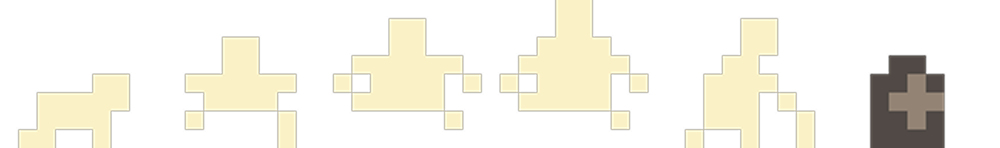

<br/>
<div align="center">
<a href="https://github.com/ShaanCoding/ReadME-Generator">

</a>
  <h1 align="center">Sisyphus</h1>
<p align="center">
A game developed for IEEE RetroJam 2025 using Raylib and Rust about Rebirth.
</p>
 
</div>

## About

Sisyphus is a game developed for **IEEE RetroJam 2025** with the theme "Rebirth", achieving **2nd place overall**. The game traps players in a haunting cycle of their own creation, telling the tale of a man consumed by his terror of mortality. In his desperation, he makes a fateful pact with the Devil, trading his soul for eternal life—only to discover that immortality comes with a price far darker than death itself.

However, the Devil, with his wicked sense of irony, granted the wish by condemning the man to an infinite loop—a seemingly endless, monotonous repetition of his last days. There is no death, but also no progress, no change, and no end.

The objective is simple, yet monumental: break the cycle. You must navigate this looping existence and find a way to confront the Devil once more, not to ask for eternal life, but to beg for freedom from it, even if that freedom means the final peace of oblivion. The game explores the true meaning of "life" when progress is impossible, and the painful irony of being reborn into the same few hours, forever.


## How to run

To run this game you have to build it from source since we do not provide an executable.

**Clone the Repository:**
   ```bash
   # Clone the project
   git clone https://github.com/diogogomesaraujo/sisyphus-retrojam-2025.git

   # Go to the directory of the project
   cd sisyphus-retrojam-2025
   ```

**Run the program**:
   ```bash
   # Run the map builder
   cargo run --bin builder

   # Run the game
   cargo run --bin main
   ```

## Requirements

- `raylib` installed
- `cargo` installed
